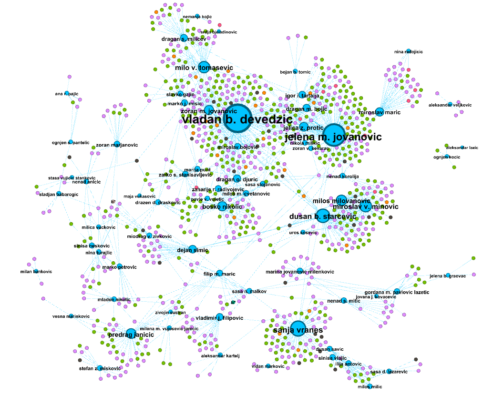
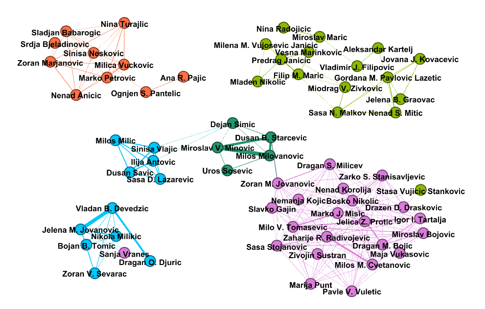
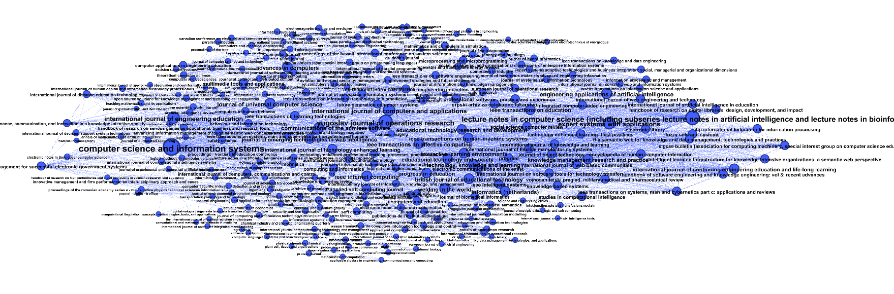
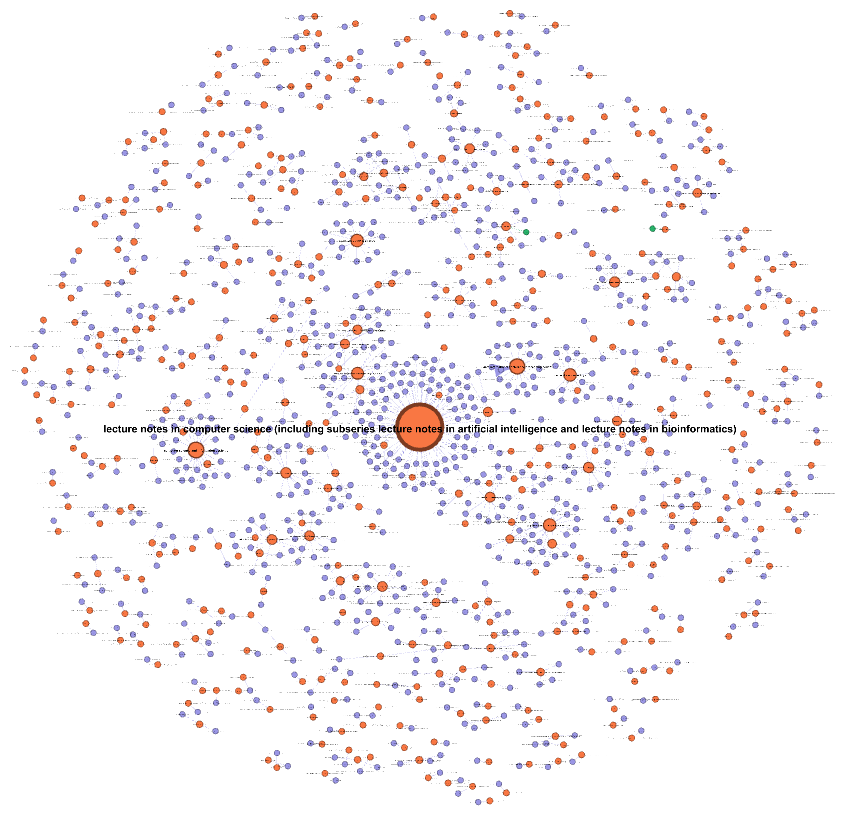
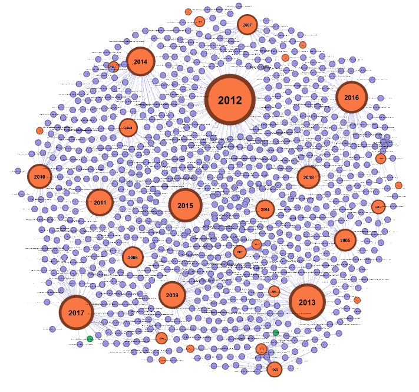
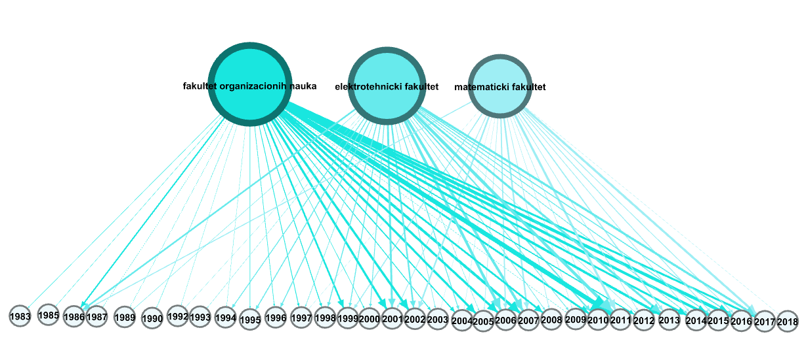
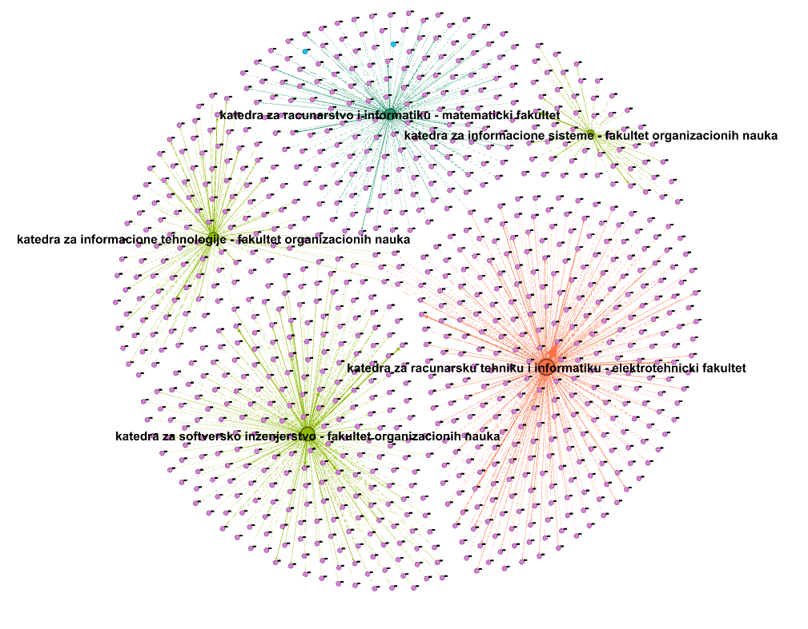

## Social Network Analysis of Computer Science research papers on University of Belgrade

### Introduction
This repository represents project work for analysis of Compute Science scientific publications on University of Belgrade. 

It is based on social network modeling, using different techniques and tools, calculating and understanding various network metrics to conduct qualitative and quantitative analysis, bibliometric and scientometric analysis. The goal was to estimate and determine the level of collaboration in research community on University of Belgrade. For that purpose [Python 3.7](https://docs.python.org/3.7/ "Python 3.7") and [NetworkX](https://networkx.github.io/ "NetworkX") packages were used and for visualization purposes, [Gephi](https://gephi.org/ "Gephi") tool was used.

Primary dataset was obtained from an indexed database of scientific research paper [Scopus](https://www.scopus.com/home.uri "Scopus"). It contains 1290 research papers up until 2018. Analysis is based on research papers published in scientific articles and conferences. That dataset is imported, cleaned and  processed in python and represents a starting point for this research. The network analysis itself was done in Python and Gephi software. 

This research was done as project work on the course in [Social Network Analysis ](https://www.etf.bg.ac.rs/en/fis/karton_predmeta/13M111ASM-2013 "Social Network Analysis ")  on Master's degree in Software Engineering.

### Examples
This are examples of various social networks created for research purposes. Network modeling was done in python (see project structure section and information on how to run python code).

##### 1.Network of professors and their published papers:



##### 2.Coauthor network - professors who worked together on publishing papers:



##### 3.Network of articles, where research papers were published:



##### 4.Network of articles and reserch papers:



##### 5.Network of scientific productivity (research papers and years in which they were published):



##### 6.Faculties and years when their professors were publishing:



##### 7.Facutlies and deparments with research papers published by their professors:




### More Information
For more information on this topic, please see the documentation. It contains both the project specification and project report.

Project report contains all of the information behind this research: visualization, metrics, results and conclusions.

### Project structure
In this repository you will find three directories:

* documentation - contains specification and project report.
* gephi - contains .gephi files that you can import and work with created already created social networks in Gephi tool. They were created by importing two, previously exported files (node and edges files), that represent social network. Those files were created and exported in python.
* src - contains python source code for data analysis and network modeling and metrics.

In src directory you will find following things:

* dataset directory - contains two .xslx files (list of authors and list of research papers).
* output directory - for every created social network in this directory are outputed following thing:
    * .csv file representing network nodes (it can be used for further analysis e.g. in Gephi).
    * .csv file representing network edges (it can be used for further analysis e.g. in Gephi).
    * .txt file containing network metrics (calculated using NetworkX).
* social_networl_analysis directory - python package containing the logic for importing, cleaning and processing dataset; creating, modeling, calculating metrics and exporting networks.
* main.py script - entry point for execution. See next section on how to run python code.

### How to run code
This project was implemented in [Python 3.7.](https://www.python.org/downloads/release/python-370/) Make sure you use the same python version. The complete list of python  modules can be found in Requirements.txt file in src folder.

It is recommended that you create new [virtual environment](https://docs.python.org/3.7/tutorial/venv.html):
`python3 -m venv social-network-analysis`.

Then you would need to activate that newly created python environment:

* On Windows:
`social-network-analysis\Scripts\activate.bat`.
* On Linux:
`source social-network-analysis/bin/activate`.

Once you have your python environment activated, first you would need to download all necessary python modules with pip. There is Requirements.txt file in scr directory. You can use the following command to automatically download all dependencies:
`pip install -r Requirements.txt`.

When the download is completed, you can run main.py script:
`python main.py`.

You will know that the script is running if you look at the console output. You should see something like this:
```importing Authors dataset... 
Importing Publications...
Exporting network CoAuthorNetwors (nodes and edges to .csv)... 
Running network analysis for CoAuthorNetwors...
```

After the script is finished, in the output directory, for every created and used social network, you will find three types of files:

* NetworkName - Nodes.csv: File containing nodes of the network (can be imported in Gephi).
* NetworkName - Edges.csv: File containing nodes of the network (can be imported in Gephi).
* NetworkName - Analytics.txt - File containing general network metrics and nodes with metrics as and other attributes as well.


